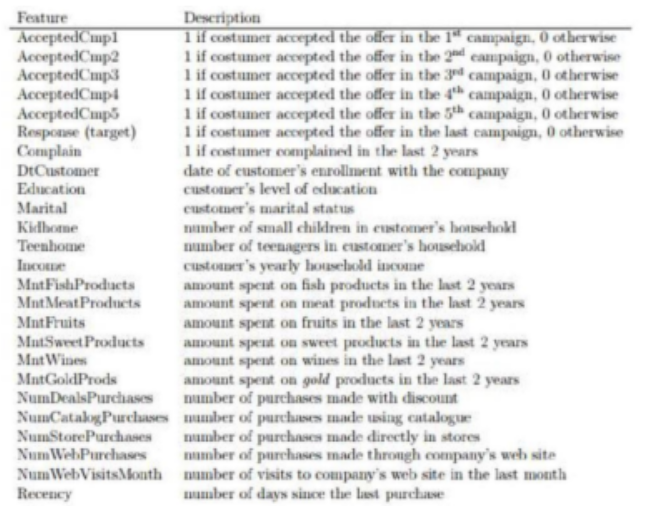

# iFood Marketing Campaign

## Summary 
* [1. About iFood](#1-about-ifood)
* [2. About the Data](#2-about-the-data)
* [3. Analysis Objectives](#3-analysis-objectives)
* [4. Methodology](4#-methodology)
* [5. Conclusion](5#-conclusion)
* [6. References](6#-references)

## 1. About iFood

iFood is a Brazilian tech company, leader in delivery in Latin America. The platform connects millions of consumers to restaurants, stores and courriers in a practical and simple way. Investing in technology and artificial intelligence, iFood is a reference in online delivery in Latin America - proud to be a Brazilian company.

Driven by the purpose of feeding the future of the world, iFood generates a positive impact on the economy, the environment and society, with income opportunities for those who work on the plataform and through social investiment in education.

## 2. About the Data

The dataset has information regarding iFood's customers, such as:

* Customers profiles;
* Products preferences;
* Marketing campaign successes and failures;
* Channel performance.

Some columns of the dataset can be seen below:

## 3. Analysis Objectives

The marketing team is looking for attract more customers. First of all, they suspect that people without kids spend more than people with children. With that in mind, the marketing team is planning to run campaigns focusing on the group of people that has children. However, they are unsure if that hypothesis is true and we need to prove that these groups have different spending on average. 

    1. Sort people in two different groups 'with kids' and 'without kids'. Compare the average spending amount between these groups.
     
After that, within the group with kids, compare the groups of people with different number of children. The marketing team asked us to examine whether there are differences in the spending amount for those with 1, 2, 3 or more children. That way, they can narrow the campaign even more.

    2. Are there differences of average spending amount between these groups? Which of them has the lower average?

## 4. Methodology

In this project, the following techniques were used:

* Exploratory Data Analysis (EDA) - Perform an Exploratory Data Analysis is important to organize and summarize the data from a sample. I've performed univariate and bivariate analysis to understand better the dataset.
* Inferential Statistics - The process of drawing conclusions about a population based on a sample. In order to achieve to conclusions, I've done Hypothesis Tests, as Independent t-test for two samples, ANOVA's Welch and Games Howell Post-hoc Test.

## 5. Conclusion

**1. Sort people in two different groups 'with kids' and 'without kids'. Compare the average spending amount between these groups.**

Our p-value was much lower than our significance level, We must therefore reject the null hypothesis that the means are equal. This way, We have statistical significant results that the means are different.

**2. Are there differences of average spending amount between these groups? Which of them has the lower average?**

* We rejected the null hypothesis that the groups are equal. Thus, We have statistical significant results to infer that there is a difference in spending among people with different numbers of children.

* We found that there is a difference between the groups 1-2 and 1-3, and there is no difference between groups 2-3, as their p-value was greater than our significance level of 0.05.

**Recommendations** 

* The average speding amount among groups with and without kids are different. Thus, They can create different campaigns;
* Groups with 2 and 3 kids have a lower expense average comparing to group with only 1 kid. Marketing team can focus on both of them aiming the increase of their spending amount;

## 6. References

* [iFood About Us](https://institucional.ifood.com.br/sobre/)
* This project is part of [EBA](https://www.renatabiaggi.com/eba) 
